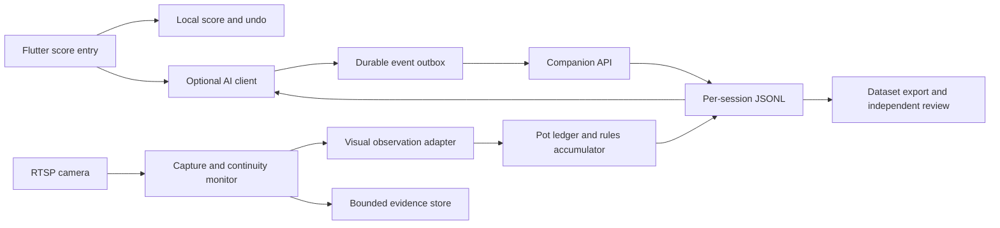

# Technical design: AI-assisted break scoring — Phase 1

> Historical document: the approved [simplification amendment](ai-scoring-simplification-amendment.md) supersedes transport, camera-alias and shipped dataset/evaluation tooling described here.
**Status:** Approved by the user on 2026-10-05, including JSON storage and a separate companion package in the current repository.
**Requirements:** [Approved PRD](ai-break-scoring-prd.md).

## 1. Problem statement

The Flutter scoreboard accepts points locally and stores player statistics through `shared_preferences`. It has no backend or camera integration. Add an optional camera observer that estimates points for submission-delimited scoring runs, with manual entry remaining primary and authoritative.

Camera processing, network requests, and dataset storage must never prevent local scoring. The entered score must not influence the prediction later compared against it. There is no automatic score posting, player recognition, turn detection, foul scoring, or model retraining.

The supplied image shows an oblique view of the whole table, with small far-side balls, glare, and distracting objects. It establishes a candidate view, not scoring feasibility. Live RTSP quality has not been tested.

**Deployment assumption:** A user-managed computer on the camera’s LAN can run a companion service during scoring sessions. Its hardware, operating system, and availability remain unconfirmed. Revisit deployment if this assumption fails.

## 2. Functional specs

| PRD criterion | Architectural response |
| --- | --- |
| AC1 — Optional assistance | Secondary AI action in additive entry only; fill an editable value and confirm through the existing local score/history flow. |
| AC2 — Fresh scoring runs | Frame creation and committed additive entries define boundaries. Grouped taps produce one entry. Corrections and undo are separate events; preserve physical table state across run resets. |
| AC3 — Configuration | `off`, `dry-run`, and `assist`, default `off`. Dry-run exposes no AI UI. Camera secrets remain service-side. |
| AC4 — Manual fallback | Feed gaps, ambiguity, stale estimates, or unsynchronised boundaries suppress suggestions. Local scoring never awaits the observer. |
| AC5 — Learning data | Immutable pre-input predictions, entry provenance, revisions, versions, availability reasons, and bounded review evidence. |
| AC6 — Launch evaluation | Independently reviewed held-out clean breaks; unavailable predictions count as failures. Report coverage, uncertainty, errors, exclusions, and boundary violations. |

**Requirement changes:** None proposed. Numeric operating thresholds and evidence policy below are explicit review decisions, not established product promises.

## 3. Design choices

### Visual inference

| Option | Advantages | Drawbacks and appropriate use |
| --- | --- | --- |
| VLM directly scores sampled images/clips | Quick feasibility baseline; flexible interpretation | May miss events or invent counts; weak continuity and respot auditability. Use experimentally. |
| Ball detection/tracking plus rules accumulator | Inspectable events and explicit continuity; efficient repeated observation | Needs reliable colour classification and calibration; clusters and distant balls are difficult. Prefer if footage evaluation supports it. |
| Structured visual observations plus rules accumulator, with optional VLM verification | Inspectable pot ledger with flexible assistance for ambiguity | More integration work; cannot recover evidence the camera never captured. Recommended component boundary. |

**Recommendation:** Separate visual observations from score accumulation. A visual adapter proposes ball observations and pot events; a rules accumulator derives points and availability. A VLM may supply observations or review ambiguous windows, but cannot overwrite the accumulator with an unexplained total. Begin with a feasibility baseline; select the production adapter from recorded-footage results. No model/vendor is fixed. Omit VLM verification if detector-only performance meets the gate.

### Processing location

| Option | Fit and tradeoff |
| --- | --- |
| Inside Flutter | Fewer deployed components, but continuous RTSP decoding/inference complicates platform support, permissions, and device resource use. |
| LAN companion | Keeps camera secrets and processing outside Flutter, supports interchangeable inference, and avoids exposing the camera to the internet; requires a running host. |
| Cloud processing | Potentially stronger inference hardware, but still needs a LAN uploader and adds bandwidth, privacy, and service dependencies. |

**Recommendation:** One optional LAN companion service, accessed through authenticated HTTPS. Any remote inference adapter requires explicit configuration and disclosure of evidence sent outside the LAN. Hosting capability must be confirmed before implementation.

### Persistence and delivery

**Decision:** Use JSON, as directed by the user. Store one append-only `session.jsonl` file per session alongside bounded visual evidence files. JSONL is JSON with one complete record per line, allowing incremental collection without rewriting the dataset. No database or message broker is required.

One process owns the camera and serialises writes. Each record carries a type, stable ID, timestamp, and linked session/frame/run/entry/prediction IDs. Lifecycle events, pot observations, immutable predictions, committed entries, label revisions, and review decisions share the session log. Reconstruct current state and ID lookups in memory when needed.

Flutter keeps a small pending-events JSON file separate from existing player-stat storage. Save updates to a temporary file, flush it, and atomically replace the previous file. Local scoring remains authoritative if saving or delivering events fails.

## 4. Software architecture and API

### Components



Flutter owns entry identities, local score mutation, history, and event delivery. The companion owns capture, visual interpretation, rules state, immutable predictions, and datasets. The service cannot update a player’s score; inference needs no player names or statistics.

For a Python companion, separate inbound `activity`, persistence `dao`, outbound camera/model `clients`, domain/services, and HTTP bootstrap under `src/ai_scoring/`. SDE owns concrete file organisation; a framework is not selected here.

### Flutter integration and prediction freeze

Existing behavior is important: `openScoreInput(player, true)` adds a break; `false` replaces the total. `PointDialog` confirms with keyboard Done. Positive taps are grouped until five seconds of inactivity; per-player snapshots support undo.

Introduce typed entry intents (`addBreak`, `replaceTotal`, `deduct`) and an entry coordinator carrying stable `entryId`/`attemptId`, frozen prediction reference, entry source, and lifecycle callbacks. AI selection only fills the editable field. Keyboard Done remains explicit confirmation without requiring another dialog.

The optional client caches the latest eligible prediction. **Before opening additive input and enabling text entry**, synchronously freeze its immutable service-issued ID and value. The first positive tap similarly freezes before local score mutation. If there is no suitable cached prediction, freeze an unavailable result; never substitute a prediction produced after input began.

New arrivals cannot replace the frozen suggestion. Feed gaps, frame changes, expiry, or new scoring activity may suppress it while the dialog remains open. Cancel creates no committed entry or run reset. Another input attempt may freeze a newer prediction, retaining distinct attempt provenance.

A positive-button group is one entry: freeze at its first tap, accumulate subsequent taps, and emit a single commit at timer finalisation. Finalise a pending group before a distinct additive entry or frame finish; retain existing five-second grouping for uninterrupted taps.

`inputStartedAt` freezes the comparison prediction; `committedAt` closes the run. Continue observing between those timestamps. New scoring in that interval remains in the event ledger and marks the entry/run boundary-uncertain; suppress the frozen suggestion once the activity is known. Do not discard those events, silently move them into the next run, or substitute a later prediction. Review determines whether the submission split or merged a real break.

Deductions and total replacements are corrections, not independently labelled breaks or run resets. Record submitted points separately from applied delta because score clamping can make them differ. Deductions during a pending group mark its label correction-affected. Link history to entry IDs. Undo of an uncommitted group cancels its attempt; undo of a committed entry invalidates its label without rewinding the physical table or reopening its run. Unattributable corrections mark affected labels for review rather than inventing revised truth.

### Frame state, run state, and continuity

Keep frame state (calibration, tracked reds/colours, pot events, pending respots, rules hypotheses, observation epoch and gaps) separate from run state (IDs, boundaries, accumulated points, availability and frozen predictions).

A committed entry clears run points while preserving physical table state: remaining reds, colour identities, pending respots, and the lowest remaining clearance colour. Reinitialise ball-on for the assumed new visit: red is on while reds remain, even when the previous visit ended after a red without its following colour. If the final-red colour opportunity was unused when the previous visit ended, the next visit starts clearance at yellow. During established clearance, continue with the lowest remaining colour. These transitions rely on the approved submission-as-visit-boundary assumption; uncertain physical state or a suspected mid-break submission remains ambiguous.

The accumulator follows the approved ball values, multiple-red scoring, red/colour alternation, last-red transition, and ascending final clearance. A respot is not a scoring event. A disappearing detection alone is insufficient evidence of a pot: consider pocket approach, disappearance, settled state, and respot observations. Preserve competing hypotheses; if they imply different totals, suppress the suggestion. Unsupported sequences become ambiguous, not detected foul penalties.

Capture continuously while a session lease is active. Inference may sample adaptively, but the continuity monitor tracks capture timestamps, processed-through watermark, stalled video, missing intervals, epoch changes, and processing gaps. A gap that could hide scoring marks that run incomplete. Reconnection cannot repair unseen pots. A subsequent committed entry begins a new run, but assistance resumes only once table/rules state is resolved; a new frame may be necessary.

Frame creation clears old predictions and requires a fresh baseline. Ball setup is not counted as potting. Submission boundaries remain the approved proxy; no inferred player movement or missed-shot turn detection is added.

### Lifecycle and API contracts

One authenticated active session lease owns each configured camera. A competing client receives a conflict while retaining manual scoring. Flutter generates session/frame/run/entry IDs locally, so offline events keep their intended identities. Mutations have unique event IDs and increasing per-session sequences.

| Endpoint | Contract |
| --- | --- |
| `POST /v1/sessions` | Open observation session; negotiate mode/capabilities using a configured camera alias. |
| `POST /v1/sessions/{id}/heartbeat` | Renew ownership lease and update clock-offset uncertainty. |
| `POST /v1/sessions/{id}/events` | Deliver ordered frame-start/end, break-commit, correction/undo, and stop events. |
| `GET /v1/sessions/{id}/prediction` | Poll prediction and observation health. |

Flutter never sends or receives the camera connection string. Example entry and prediction payloads:

```json
{
  "eventId": "event-uuid", "sequence": 12, "type": "break_committed",
  "frameId": "frame-uuid", "runId": "run-uuid", "nextRunId": "next-run-uuid",
  "entryId": "entry-uuid", "attemptId": "attempt-uuid",
  "inputStartedAt": "client-timestamp", "committedAt": "client-timestamp",
  "predictionId": "prediction-uuid", "predictionAvailability": "available",
  "submittedPoints": 15, "appliedScoreDelta": 15, "source": "manual"
}
```

```json
{
  "predictionId": "prediction-uuid", "frameId": "frame-uuid", "runId": "run-uuid",
  "status": "available", "points": 15, "observedThrough": "service-timestamp",
  "observationEpoch": "epoch-uuid", "lastAppliedEventSequence": 11,
  "expiresAt": "service-timestamp", "modelVersion": "adapter-version",
  "rulesVersion": "rules-version", "qualityReasons": []
}
```

Unavailable responses carry `points: null` and reasons such as `feed_gap`, `table_not_initialised`, `ambiguous_pot`, `stale`, or `boundary_unsynchronised`. Entry sources distinguish `manual`, `ai_selected`, and `ai_selected_edited`.

A single writer processes session events in sequence. An identical event ID and payload returns its prior acknowledgement; ID reuse with changed payload conflicts. Missing sequences block later boundary events. Before acknowledging an accepted event, append its complete newline-terminated JSON record and flush it to durable storage. The record contains enough information to reconstruct its effects: closing the prior run, establishing the next run, and recording the entry/comparison with its frozen prediction. No coordinated writes across multiple files are needed. Update in-memory state from the durable record. On restart, replay accepted records to rebuild state, event identities, and acknowledgements; retries cannot duplicate a boundary. Submitted points never inform visual inference or rules-state decisions.

Persist a prediction before publishing its ID to Flutter. Recovery accepts complete newline-terminated records. Discard an incomplete final write by truncating to the last complete record before further appends; it was never acknowledged. A malformed complete record is a storage fault: stop collection for that session and preserve the file for inspection, without blocking manual scoring. Restart also establishes an observation discontinuity; replaying metadata cannot recover unseen camera activity.

Local score mutation is synchronous; observer delivery is queued independently. Immediately advance the expected local run and hide old predictions, without waiting for acknowledgement. Only predictions matching the expected IDs and applied sequence can be offered.

Retain a bounded observation log so delayed boundaries can be applied at **recorded commit time**, not HTTP arrival time. Handshake/heartbeats estimate clock offset and uncertainty. Replay/repartition observations only within a reliable retained window; otherwise mark boundary unsynchronised and suppress estimates. Events spanning a boundary ambiguously remain uncertain.

Persist pending events in the separate JSON file described above. Persistence failure cannot prevent scoring: hide assistance and mark collection-health loss where possible. This design does not add full match restoration. Process restart starts a new observer session, not a continuation of an old run.

Finish/confirmed exit stops polling immediately and queues an idempotent stop. Receipt stops capture/inference; lease expiry bounds cleanup if delivery fails. `off` initialises neither processing nor collection; transition to off may send a stop solely to release existing resources.

### Dataset and storage

Each session directory contains `session.jsonl` and an `evidence/` directory. The log contains linked JSON records:

| Record type | Key contents |
| --- | --- |
| Session/frame/run events | IDs, mode, lease, boundaries, calibration/epochs, continuity and quality reasons. |
| Pot observations | Event ID, ball/value, time window, certainty and respot association. |
| Predictions | Immutable ID, points or null, watermark, quality and model/rules versions. |
| Committed entries | Entry/attempt IDs, frozen prediction or unavailability reason, input/commit times, submitted points/delta/source. |
| Label revisions | Correction/undo references, affected entries, validity and revised provisional labels. |
| Evidence references | Relative file path, capture interval, expiry and availability. |
| Review decisions | Eligibility, independent score, boundary quality, reviewer and evidence sufficiency. |

Predictions are immutable. Corrections and review decisions append linked records instead of rewriting history; reconstruct the latest label status during export. Retain agreements, mismatches, and unavailable results. A client entry without a companion prediction explicitly records its absence; collection losses are separately reported.

Use a bounded rolling evidence buffer and short event windows/selected frames; crop to the table where practical and omit audio. Agreement evidence also needs enough context for independent review. Set time and size limits. References may outlive evidence files, with missing evidence reported during export; insufficient evidence cannot silently qualify a record for reviewed accuracy.

### Configuration and security

App configuration contains mode, companion endpoint, camera alias and pairing credentials. Use deployment-controlled settings for Phase 1; dry-run adds no controls. Service configuration contains camera secrets, adapter settings, storage and retention/access policy.

Keep camera credentials out of app builds, UI, logs, errors and exports. Authenticate HTTPS connections without disabling certificate validation; restrict LAN exposure and avoid public camera port forwarding. Remote inference is separately configured and disclosed.

**Decisions to settle before collection/launch:** companion hardware/platform; visual adapter/model; evidence retention/storage cap/access and external transfer policy; prediction freshness/settle thresholds; clock uncertainty, replay-window and lease thresholds; evaluation minimum sample size/confidence criterion. No arbitrary numeric promises are introduced here.

### Feasibility and evaluation

Validate recorded footage across near/far pots, all colours, multiple reds, respots, last-red transition, clearance, clusters, glare, occlusion, distracting objects, feed loss and delayed submissions. Calibrate table/pockets/perspective. Perspective correction cannot recover missing pixels; inadequate evidence may require repositioning or another camera.

Select held-out sessions independently of prediction success. Reviewers first label actual clean-break scores and valid boundaries without seeing AI totals or entered scores. Determine eligibility from supported play and boundary criteria, never confidence. Split tuning and evaluation by session.

Compare immutable pre-input predictions against independent labels. Count missing predictions as failures for eligible breaks; report exact numerator/denominator, confidence interval, coverage, error magnitude, exclusions, boundary violations and collection losses. Do not remove difficult supported camera conditions because the model failed. Report independently established fouls/boundary violations separately. AI-selected and manual entries are provisional until independently reviewed.

Broader assist rollout requires **>90% exact-score accuracy** under AC6. Predeclare sample-size and confidence targets before evaluating the launch set.

## 5. Failure scenarios

| Failure | Response and recovery |
| --- | --- |
| Camera unreachable/auth rejected | No suggestion; manual works. Record sanitised reason; bounded retry. |
| Feed gap/frozen video/service restart | Mark discontinuity; reconnect cannot restore unseen points. Require resolved state before assistance resumes. |
| Ambiguous colour/pot/respot/occlusion | Suppress differing-score hypotheses; retain evidence and quality reason. |
| Camera moved | Invalidate calibration; require fresh baseline. |
| Model timeout/malformed output | No suggestion; record version/failure without substituting submitted score. |
| Delayed/duplicate/out-of-order delivery | Local scores proceed; hide old/unsynchronised predictions; ordered idempotent retry and bounded replay. |
| New frame with outstanding requests | Frame/run IDs reject stale responses. |
| App crash/stop unreachable | Lease expiry stops capture; next app session starts fresh. |
| Disk full/evidence expiry/outbox failure | Manual works; record collection/reviewability loss; bound writes and suppress unverifiable assistance. |
| Correction/undo | Local history wins; revise labels without modifying predictions or rewinding the table. |
| User/AI mismatch | User score wins; collect discrepancy for independent review. |
| Delayed/omitted/mid-break entry | Flag split/merged boundaries; no invented turn detection. |
| Competing camera session | Explicit observer conflict; manual scoring remains available. |

**Approval boundary:** Architecture approved for implementation planning. Camera feasibility, model choice, external inference, evidence policy and deployment remain explicit unresolved decisions; approval does not establish those capabilities or authorise external inference or publication.
